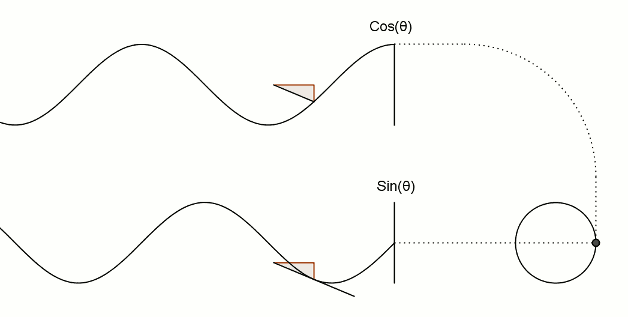

# 1. 三角
  + 1.1 三角函数
    + SIN：∠A的对边比斜边=a/c
    + COS：∠A的邻边比斜边=b/c
    + TAN：∠A的对边比邻边=a/b
    + COT：∠A的邻边比对边=b/a
    + 
  + 1.2 三角函数对应关系
    + 
    + 如图，六边形的六个角分别代表六种三角函数，存在如下关系：
    + 1）、对角相乘乘积为1，即sinθ·cscθ=1； cosθ·secθ=1； tanθ·cotθ=1。  
    2）、六边形任意相邻的三个顶点代表的三角函数，处于中间位置的函数值等于与它相邻两个函数值的乘积，  
    如：sinθ=cosθ·tanθ；tanθ=sinθ·secθ。  
    3）、阴影部分的三角形，处于上方两个顶点的平方之和等于下顶点的平方值，如：
      + $\sin θ^2+\cos θ^2 = 1^2$
      + $\tan θ^2+1^2 =\sec θ^2$
      + $1^2+\cot θ^2 =\csc θ^2$
---
# 2. 圆
+ 2.1 圆周率（π）是圆的周长与直径的比值$π$
  + 
+ 2.2 弧度 $2π$
  + 定义，一周的弧度数为2πr/r=2π，360°角=2π弧度.  
  因此，1弧度约为57.3°，即57°17'44.806''，  
  1°为π/180弧度，近似值为0.01745弧度，  
  周角为2π弧度，平角（即180°角）为π弧度，直角为π/2弧度。
  + 
+ 2.3 正弦,余弦,圆之间的关系
  + 定义:正弦函数 $y=\sin x$, 定义域: R 值域:[-1,1]  
    +   
  &nbsp;&nbsp;&nbsp;&nbsp;&nbsp;&nbsp;&nbsp;&nbsp;余弦函数
  &nbsp;$y=\cos x$, 定义域: R 值域:[-1,1]
    + 
  + &nbsp;&nbsp;&nbsp;&nbsp;&nbsp;&nbsp;$|\sin x|\le1$&nbsp;&nbsp;&nbsp;&nbsp;&nbsp;&nbsp;$|\cos x|\le 1$
  + 注意曲轴是如何在一个圆中移动的，  
  而上下左右移动形似波浪的支杆则对应正弦函数和余弦函数：
  + 
---
  + 以下是关于正弦函数和余弦函数的更为传统的阐述。  
  图中的黑线为圆，正弦函数和余弦函数分别依附圆周形成各自的路径。  
  Y值（也就是说红线部分）为正弦函数值，  
  X值（即蓝线部分）为余弦函数值。
  + 
  + 对应的圆的关系
  + 
---
+ 2.4 正切,余切,圆之间的关系
  + 正切 $y=\tan x$ &nbsp;&nbsp;&nbsp; 定义域{$x|x\neq kπ+\frac{π}{2},k \in Z$}
  &nbsp;&nbsp;&nbsp;值域是$R$
    + 
  + 余切 $y=\cot x$ &nbsp;&nbsp;&nbsp; 定义域{$x|x\neq kπ,k \in Z$}
  &nbsp;&nbsp;&nbsp;值域是$R$
    + 
  + 有趣的补充
  + 三角关系对于正切函数（tan）的定义至关重要。  
  直角三角形的斜边和靠近圆右侧的垂直边的交叉点定义了正切函数。
    + 
  + 在没有三角形的情况下，还可以用另一种方式观察正切函数：
    + 