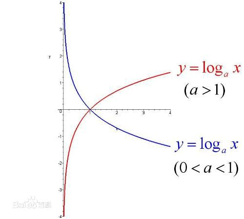

# 1. 数字符号
+ 1.1 对数$e$的定义
  + e是自然对数的底数，是一个无限不循环小数。  
  e在科学技术中用得非常多，一般不使用以10为底数的对数。  
  学习了高等数学后就会知道，许多结果和它有紧密的联系，以e为底数，许多式子都是最简的，用它是最“自然”的，所以叫“自然对数”，因而在涉及对数运算的计算中一般使用它  
  是一个数学符号，没有很具体的意义。  
  其值是2.71828……，是这样定义的： 
  当$n\rightarrow\infty$时，$(1+\frac{1}{n})^n$的极限。
  + 自然对数是以常数e为底数的对数，记作lnN（N>0）。  
  在物理学，生物学等自然科学中有重要的意义，一般表示方法为$\ln x$。  
  数学中也常见以$\log x$表示自然对数。
    + 
+ 1.2 ln log lg
  + ln:ln是以e为底
  + log:log是以任何数为底
  + lg:lg是以10为底